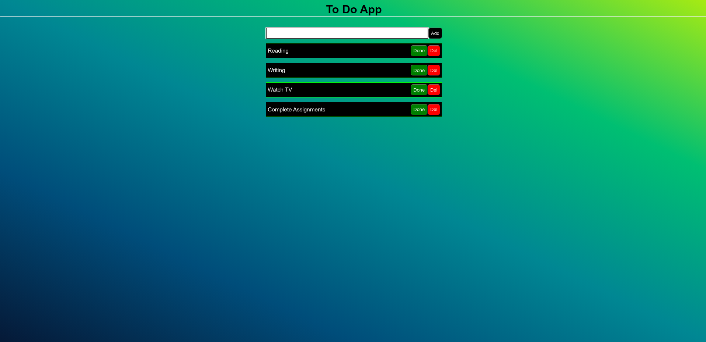

# 🖹 To Do App
## Welcome to My To Do App Project !

### ☛ Version
v 1.0.0

### ☛ Languages Used
1. Html, CSS, JavaScript

### ☛ Features
1. Currency Conversion:
Add to do items
delete to do items
done / complete to do items


### ☛ Images




### ☛ IDE (Integrated Development Environment)
VS Code

### ☛ Installation

1. Clone the repository:

   ```bash
   https://github.com/randeera/##########.git


### ☛ Contact Me

- Email-  mailto:khkrandeera@gmail.com
- Linkedin-https://www.linkedin.com/in/randeera/

### ☛ Follow Me

- GitHub-https://github.com/randeera
- Linkedin-https://www.linkedin.com/in/randeera/

### ☛ License
This application is licensed under this <a href="./LICENSE.txt">License</a>
MIT License

Copyright © 2024 | Kaveendra Randeera | All Rights Reserved.
